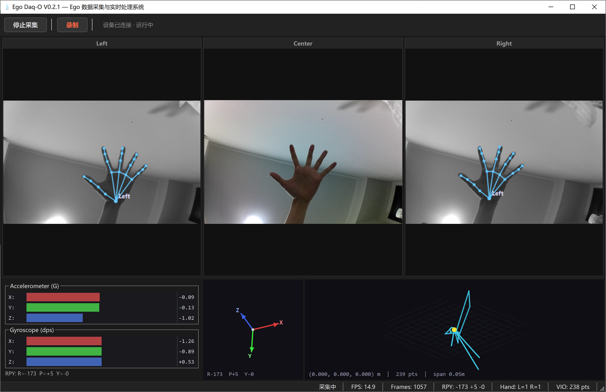

# Ego Daq-O — Ego 数据采集与实时处理系统

> **Version 0.2.1** | 具身智能 Ego 数据采集软件

[English](#english) | 中文



---

## 中文

### 环境要求

- Python >= 3.12, < 3.13（PySide6 与 3.13 存在 ABI 兼容性问题）
- Ego 数采相机（三目 + IMU）

### 安装与启动

**方式一：uv 包管理器**

```bash
git clone <repo-url>
cd EgoDaO
uv python pin 3.12
uv sync
uv pip install pyside6 mediapipe
python -m DaO.main
```

**方式二：手动 venv**

```bash
# Windows
python -m venv .venv
.venv\Scripts\activate
pip install depthai numpy opencv-python pyside6 mediapipe
python -m DaO.main
```

```bash
# Ubuntu / macOS
python3 -m venv .venv
source .venv/bin/activate
pip install depthai numpy opencv-python pyside6 mediapipe
python -m DaO.main
```

**方式三：一键启动**

使用release中的包或在配置好上述环境的情况下
```bash
# Windows
run.bat

# Ubuntu / macOS
chmod +x run.sh && ./run.sh
```

### 界面与操作

| 区域 | 内容 |
|------|------|
| 工具栏 | 「采集」连接/断开 OAK 相机；「录制」开始/停止数据记录 |
| 中部 | 三目相机实时画面（左目 / 主视角 / 右目），左右目带手部骨架叠加 |
| 底部左侧 | IMU 条形图（加速度计 G + 陀螺仪 dps），含互补滤波姿态估计 |
| 底部中 | IMU 3D 姿态可视化 |
| 底部右 | VIO 3D 空间定位轨迹 |
| 状态栏 | FPS / Frames / RPY / Hand / VIO 点数 |

### 录制数据格式

#### 原始数据 (`Data/Raw/<时间戳>/`)

| 文件 | 内容 |
|------|------|
| `left_cam.mp4` / `center_cam.mp4` / `right_cam.mp4` | 三目相机视频 |
| `imu.csv` | IMU 加速度计 & 陀螺仪原始数据 |
| `hands.json` | 手部 21 关键点检测结果 |
| `vio.json` | VIO 位姿矩阵 (4×4) |

#### HumanEgo 兼容数据 (`Data/HumanEgo/mps_<时间戳>_vrs/preprocess/all_data/`)

与 [HumanEgo](https://github.com/TX-Leo/HumanEgo) 预处理 pipeline 完全兼容：

| 文件 | 内容 |
|------|------|
| `{idx:05d}/rgb.png` | 主视角 RGB 帧 |
| `{idx:05d}/aria_cam_rgb.json` | 相机内参 K、外参 c2w、FOV、FPS |
| `{idx:05d}/aria_slam.json` | SLAM 轨迹（平移、RPY、线速度、角速度） |
| `{idx:05d}/aria_hands.json` | 双手 21 关键点 3D/2D、关节角度 |
| `{idx:05d}/training_data.json` | 训练数据格式（供 DatasetGen 直接读取） |

### 项目结构

```
EgoDaO/
├── DaO/                        # 主代码包
│   ├── main.py
│   ├── config/config.py        # 相机 / IMU / 录制参数
│   ├── core/
│   │   ├── pipeline.py         # DepthAI Capture pipeline
│   │   ├── capture_worker.py   # 后台采集线程（threading.Thread）
│   │   ├── recorder.py         # 原始数据录制
│   │   ├── humanego_recorder.py  # HumanEgo 兼容格式录制
│   │   └── hand_tracker.py     # MediaPipe 手部 21 关键点检测
│   └── ui/
│       ├── main_window.py      # 主窗口 & 信号路由
│       ├── camera_view.py      # 三目相机画面 + 手部骨架叠加
│       ├── imu_panel.py        # IMU 条形图 + 互补滤波
│       ├── imu_3d_widget.py    # IMU 3D 姿态
│       └── vio_3d_widget.py    # VIO 3D 轨迹
├── test/                       # 测试脚本 & 参考算法（git 排除）
├── pyproject.toml
├── run.bat / run.sh            # 一键启动脚本
├── README.md
├── PROGRESS.md
└── TODO.md
```

### 开发进度

详见 [PROGRESS.md](./PROGRESS.md) 和 [TODO.md](./TODO.md)

---

## English

> A data acquisition software for embodied AI ego-centric data collection.
> See [Chinese section above](#中文) for the complete documentation.

### Quick Start

```bash
git clone <repo-url>
cd EgoDaO
python -m venv .venv
source .venv/bin/activate  # or .venv\Scripts\activate on Windows
pip install depthai numpy opencv-python pyside6 mediapipe
python -m DaO.main
```

Or use the launcher script: `run.bat` (Windows) / `run.sh` (Linux/macOS).

### Key Features

- **3-camera real-time feed** with hand skeleton overlay on left/right views
- **IMU visualization** — accelerometer & gyroscope bar gauges + 3D attitude
- **VIO 3D trajectory** — real-time spatial positioning
- **Dual recording format** — raw data (.mp4 + .csv + .json) and HumanEgo-compatible format

### Output

- `Data/Raw/` — raw recordings (video, IMU, hands, VIO)
- `Data/HumanEgo/` — HumanEgo pipeline-compatible per-frame JSON + PNG
